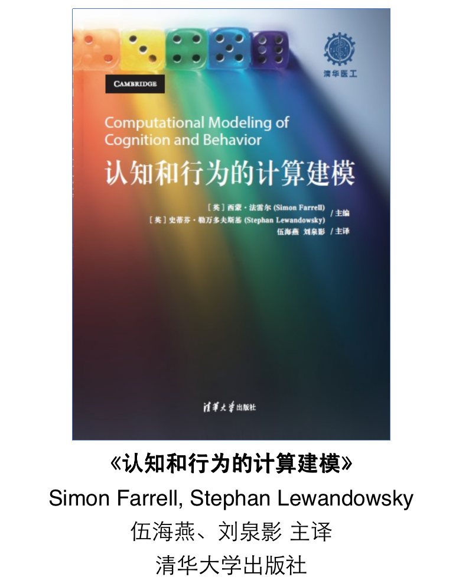
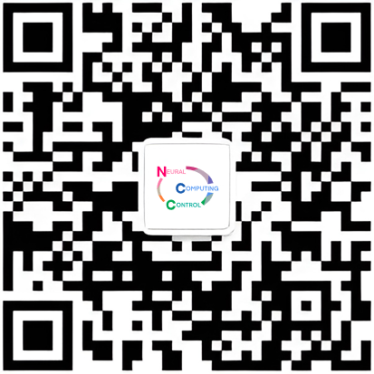

# Computational Modeling of Cognition and Behavior
*SusTech BME — Machine Learning & NeuroEngineering (2021)*

A curated collection of **lecture slides** and **hands-on materials (Python/R)** for the *Computational Modeling of Cognition and Behavior* course at Southern University of Science and Technology (SUSTech). The goal is to help students understand and apply computational models to study human cognition and behavior.

## Table of Contents
- [Overview](#overview)
- [Textbook Reference](#textbook-reference)
- [How to Use This Repository](#how-to-use-this-repository)
- [License & Disclaimer](#license--disclaimer)
- [Join the NCC Lab Community](#join-the-ncc-lab-community)

---

## Overview
This repository hosts materials for **Machine Learning & NeuroEngineering** at SUSTech. It includes lecture slides (PDFs) and, where available, example code/snippets (Python/R) illustrating methods commonly used in cognitive and behavioral modeling:

- **Foundations of Computational Neuroscience & Machine Learning** — core neuro and ML concepts for modeling cognition and behavior.  
- **Neural Data Processing** — basic pipelines for EEG/BCI and probability/statistics for signal–noise reasoning.  
- **Bayesian Methods & Sampling** — priors/posteriors, MCMC, Gibbs/JAGS, and practical diagnostics.  
- **Deep Learning** — gradient descent, backpropagation, CNNs, hands-on training, and links to the visual system.

---

## Textbook Reference
Primary reference (Chinese translation of the English original):

**Computational Modeling of Cognition and Behavior**  
Editors: *Simon Farrell* & *Stephan Lewandowsky*  
Chinese translation by *Haiyan Wu* & *Quanying Liu*

## How to Use This Repository
   git clone https://github.com/ncclab-sustech/Computational_Modeling_of_Cognition_and_Behavior.git
   cd Computational_Modeling_of_Cognition_and_Behavior

## License & Disclaimer
All course materials, including but not limited to slides and code, are the copyright of **Southern University of Science and Technology**, **Prof. Quanying Liu**, and her team.

- **Usage:** Materials are provided for **personal academic and research use only**.  
- **Commercial use is strictly prohibited.**  
- **Attribution:** Please respect the authors’ work and **cite the source** when using or adapting these materials.

---

## Join the NCC Lab Community

**WeChat Official Account**  

**Bilibili Channel**  
